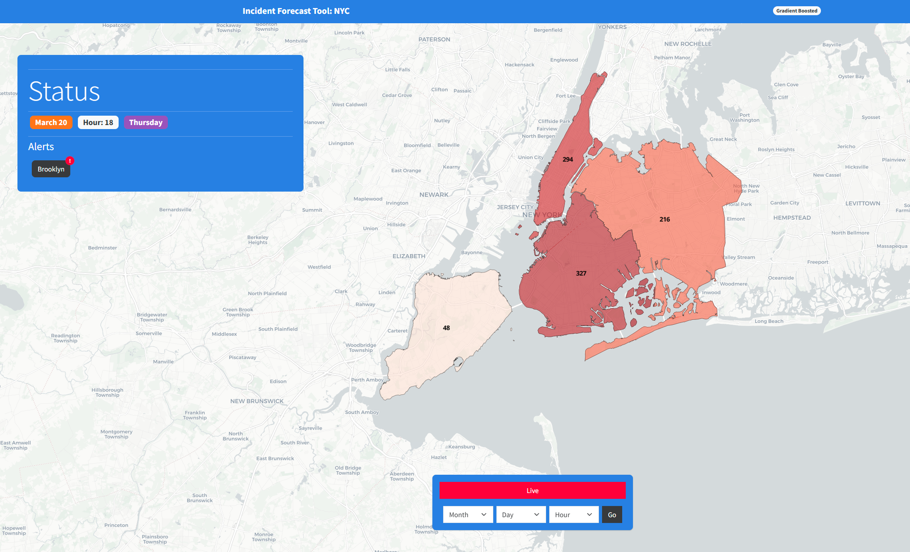
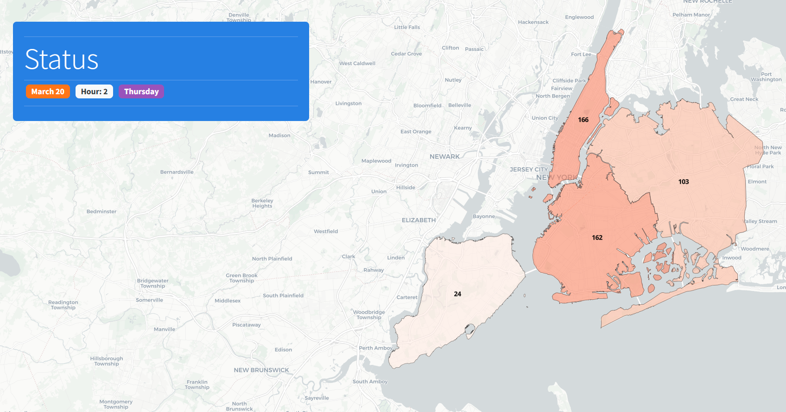
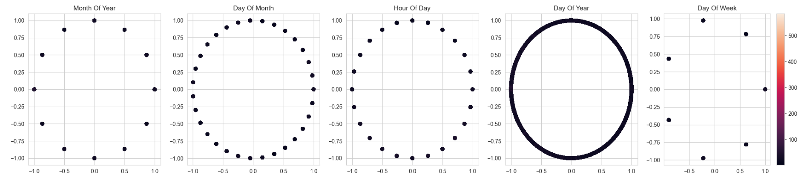
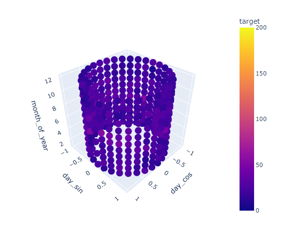
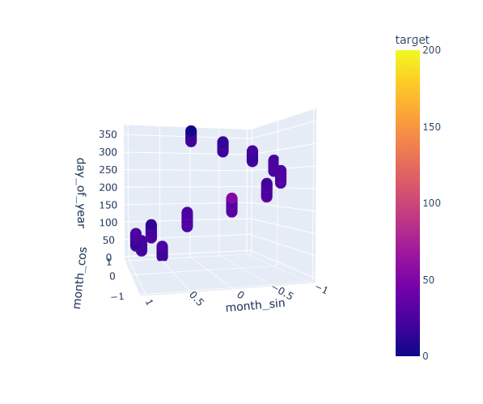
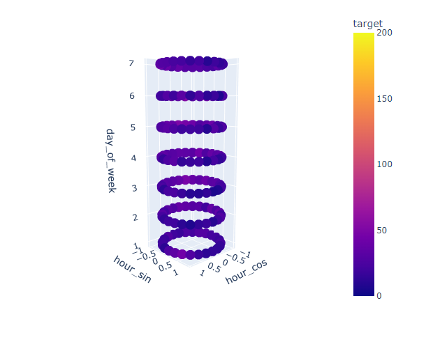
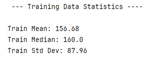
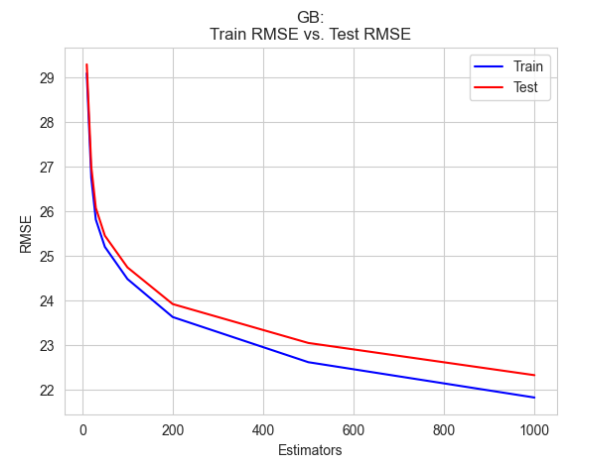

 # NYC Incident Prediction Model

## Project Information

- [Slide Deck](documents/presentation.pdf)

## Instructions

- Download dataset from NYC Open Data [here](https://data.cityofnewyork.us/Public-Safety/NYPD-Calls-for-Service-Historic-/d6zx-ckhd/about_data)
- Place dataset in "/data/" directory and name it **"nypd_911.csv"**
- The [GenerateDataset](notebooks/GenerateDataset.ipynb) notebook will aggregate the data into hourly entries and clean it.
- [CyclicEncode](notebooks/CyclicEncode.ipynb) notebook is responsible for encoding time data into periodic 2d data.
- [IncidentPredictionModel](notebooks/IncidentPredictionModel.ipynb) notebook is the main notebook where the model is created and tuned.

## Gallery

### Example Real World Application

An application that assists EMS and police services. With more granularity, this model has the potential to redefine how communities offer EMS services.

##### Heavy Load

##### Light Load

### Cyclic Time Encoding

#### 2D Representation

#### 3D Representation

Day (as period) across months of the year

Month (as period) across days of the year

Hour (as period) across days of the week

### Model Results

**Training Data Statistics**

**Tuned Gradient Boosted model's performance relative to testing and training data.**

